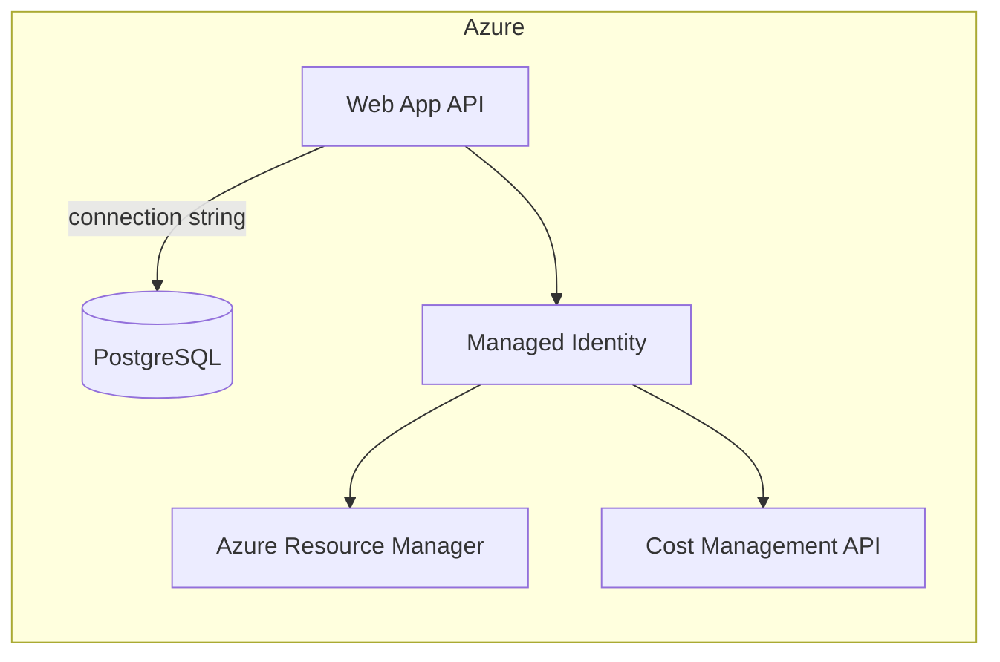

# Deploy to Azure Web App with managed identity

This guide covers running the API on an **existing Azure Web App** with **PostgreSQL** and **managed identity** for Azure API access (no client secret).

The React UI is **built into the same Web App** — the pipeline runs `npm run build` and FastAPI serves `frontend/build` at `/`.

## Production go-live checklist

Complete these **before** pointing users at the app:

| Step | Action |
|------|--------|
| 1 | Enable **system-assigned managed identity** on the Web App |
| 2 | Assign **Reader** + **Cost Management Reader** on the target subscription |
| 3 | Set **application settings** (see table below) — especially `JWT_SECRET`, `DATABASE_URL`, and Azure OpenAI (`OPENAI_KEY` or `AI_AUTH_MODE=azure_ad`) |
| 4 | Change default **admin/viewer passwords** (`ADMIN_PASSWORD`, `VIEWER_PASSWORD`) |
| 5 | Allow Web App outbound IPs in **PostgreSQL firewall** (or enable Azure services) |
| 6 | Push to `dev-slot` or `main` to trigger **Azure DevOps pipeline** (build → test → zip deploy) |
| 7 | Verify `/health/live` and `/health/ready` return 200 |
| 8 | Sign in → **Settings** → Azure → **Test connection** |
| 9 | Run **Sync** (inventory + cost), then **Analyze** |
| 10 | Configure **Azure OpenAI** in Settings (`AI_AUTH_MODE=azure_ad` + Cognitive Services OpenAI User role on the OpenAI resource) |

**Pipeline:** `azure-pipelines.yml` builds the frontend, runs `pytest`, and zip-deploys to `CostOptimizeRecommender` in resource group `costperfoptimizer`.

**Do not** set `APP_ENV=production` locally without PostgreSQL — startup validation requires a real database.

## Architecture



## Configure your existing Web App

You only need four things on a Web App you already own:

1. **Managed identity** enabled
2. **RBAC roles** on your subscription
3. **App settings** (database + auth)
4. **API code** deployed with the correct startup command

### Step 1 — Enable managed identity

Portal: Web App → **Identity** → **System assigned** → **On** → Save

Or CLI:

```bash
az webapp identity assign -g <resource-group> -n <app-name>
```

For **user-assigned** identity, assign it on the Web App and note the **client ID**.

### Step 2 — Assign RBAC roles

```bash
PRINCIPAL_ID=$(az webapp identity show -g <resource-group> -n <app-name> --query principalId -o tsv)
SUBSCRIPTION_ID=<subscription-id>

az role assignment create \
  --assignee $PRINCIPAL_ID \
  --role "Reader" \
  --scope /subscriptions/$SUBSCRIPTION_ID

az role assignment create \
  --assignee $PRINCIPAL_ID \
  --role "Cost Management Reader" \
  --scope /subscriptions/$SUBSCRIPTION_ID
```

Role propagation can take a few minutes.

### Step 3 — Set application settings

Portal: Web App → **Configuration** → **Application settings**

Or CLI:

```bash
# Generate once: python -c "from cryptography.fernet import Fernet; print(Fernet.generate_key().decode())"

az webapp config appsettings set -g <resource-group> -n <app-name> --settings \
  DATABASE_URL='postgresql://<user>:<password>@<host>:5432/<db>?sslmode=require' \
  AZURE_AUTH_MODE='managed_identity' \
  AZURE_DEFAULT_SUBSCRIPTION_ID='<subscription-id>' \
  APP_ENV='production' \
  JWT_SECRET='<random-secret>' \
  ADMIN_PASSWORD='<strong-password>' \
  VIEWER_PASSWORD='<strong-password>' \
  AI_AUTH_MODE='api_key' \
  OPENAI_KEY='<azure-openai-api-key>' \
  OPENAI_ENDPOINT='https://<resource>.openai.azure.com/' \
  OPENAI_DEPLOYMENT='gpt-4o-mini' \
  CORS_ALLOWED_ORIGINS='https://<app-name>.azurewebsites.net' \
  SCM_DO_BUILD_DURING_DEPLOYMENT='true' \
  WEBSITES_PORT='8000'
```

| Setting | Required | Notes |
|---------|----------|-------|
| `DATABASE_URL` | Yes | Your existing PostgreSQL connection string |
| `AZURE_AUTH_MODE` | Yes | Set to `managed_identity` |
| `AZURE_DEFAULT_SUBSCRIPTION_ID` | Yes | Subscription to analyze |
| `APP_ENV` | Yes | Set to `production` |
| `JWT_SECRET` | Yes | Random 32+ character secret — required whenever `APP_ENV=production` |
| `ADMIN_PASSWORD` / `VIEWER_PASSWORD` | Yes | Change from defaults before go-live |
| `CORS_ALLOWED_ORIGINS` | Yes | `https://<app-name>.azurewebsites.net` (same-origin UI) |
| `WEBSITES_PORT` | Yes | `8000` — must match uvicorn port |
| `K8S_AGENT_TOKEN` | Only with K8s agent | Set `REQUIRE_K8S_AGENT_TOKEN=true` when used |
| `AZURE_CLIENT_ID` | Only for user-assigned MI | Leave unset for system-assigned |
| `AI_AUTH_MODE` | For AI recommendations | `api_key` or `azure_ad` |
| `OPENAI_KEY` | For `api_key` auth | Azure OpenAI API key; overrides a stale encrypted DB value |
| `OPENAI_API_KEY` | Alternate | Same as `OPENAI_KEY` if you prefer the standard name |
| `OPENAI_ENDPOINT` | For AI | e.g. `https://<resource>.openai.azure.com/` |
| `OPENAI_DEPLOYMENT` | For AI | e.g. `gpt-4o-mini` |

**Database alternatives:** instead of `DATABASE_URL`, you can add a **PostgreSQL connection string** under Web App → Configuration → Connection strings (`POSTGRESQLCONNSTR_<name>`). The app reads it at startup.

**PostgreSQL firewall:** allow Azure services (or the Web App outbound IPs) so the app can reach your database.

### Step 4 — Startup command

Portal: Web App → **Configuration** → **General settings** → **Startup Command**

```text
antenv/bin/python -m uvicorn app.main:app --host 0.0.0.0 --port 8000 --timeout-keep-alive 75
```

Use `antenv/bin/python` (Oryx virtualenv), not `/opt/python/...` — system Python does not have packages from `requirements.txt`.

Ensure the runtime stack is **Python 3.13** (Linux), matching `azure-pipelines.yml`.

### Step 5 — Deploy via pipeline (recommended)

Push to `main` or `dev-slot`. The pipeline:

1. Builds `frontend/build`
2. Runs `pytest tests/`
3. Zip-deploys to App Service with Oryx Python install

### Step 5 (alternate) — Manual zip deploy

If you deploy from this repo root:

```bash
# From repo root
pip install -r requirements.txt -t .python_packages/lib/site-packages
zip -r deploy.zip app requirements.txt .python_packages

az webapp deployment source config-zip \
  -g <resource-group> \
  -n <app-name> \
  --src deploy.zip
```

Or use your existing pipeline (Azure DevOps — see `azure-pipelines.yml`).

### Step 6 — Validate

```bash
curl https://<app-name>.azurewebsites.net/health/live
curl https://<app-name>.azurewebsites.net/health/ready
curl https://<app-name>.azurewebsites.net/settings/status
```

Open `https://<app-name>.azurewebsites.net` in a browser — the React UI is served from the same host.

Expected in `/settings/status`:

- `deployment.is_app_service`: `true`
- `azure.auth_mode`: `managed_identity`
- `database.active_url`: your PostgreSQL (masked)

Open the UI → **Settings** → Azure → **Test connection**, then run **Sync** and **Analyze**.

### Step 7 — Frontend

No separate frontend deploy is required when using the Azure DevOps pipeline — `frontend/build` is included in the zip and served by FastAPI.

If you host the UI elsewhere, build with:

```bash
cd frontend
npm ci && npm run build
```

Add that host URL to `CORS_ALLOWED_ORIGINS`.

## Troubleshooting

| Symptom | Fix |
|---------|-----|
| `DefaultAzureCredential` / auth errors | Confirm managed identity is enabled and RBAC roles are assigned |
| Database connection failed | Verify `DATABASE_URL` or `POSTGRESQLCONNSTR_*`; check firewall allows Azure services |
| CORS errors in browser | Add frontend URL to `CORS_ALLOWED_ORIGINS` and save in Settings |
| 403 on cost queries | Assign **Cost Management Reader** (not just Reader) |

## What the app does at startup

1. Detects App Service via `WEBSITE_SITE_NAME`
2. Reads database URL from `DATABASE_URL` or connection strings
3. Runs schema migration
4. Seeds Azure settings with managed identity if the database has no Azure config
5. Loads credentials via `ManagedIdentityCredential`

No client secret is required for Azure API access when using managed identity.
