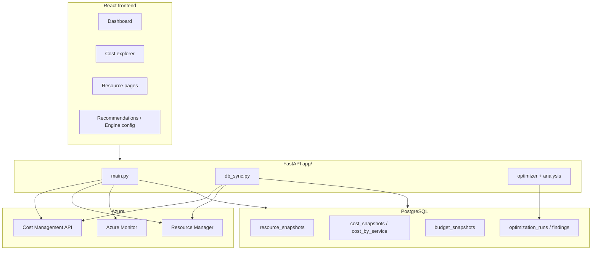

# Azure Cost Optimizer — Functionality (`dev-slot`)

Enterprise FinOps platform on **`dev-slot`**: Azure Cost Management for spend visibility, ARM inventory across major resource types, optimization rules with savings estimates, and optional Kubernetes utilization telemetry.

---

## Cost data policy

**All dollar amounts shown to users must come from Azure Cost Management** (`Microsoft.CostManagement`, API `2024-08-01`). No Retail Prices API, no SKU list-price math, and no hard-coded $/GB heuristics in user-facing or persisted cost fields.

| Cost type | Source | Field / API |
|-----------|--------|-------------|
| Actual spend (subscription, RG, service, resource) | Cost Management **Query** (`ActualCost`, `PreTaxCost`) | `cost_usd`, `PreTaxCost`, `monthly_cost_usd` |
| Budgets & current spend | Cost Management **Budgets** | `BudgetSnapshot` |
| Forecast | Cost Management **Forecast** | `/costs/forecast` |
| Optimization **baseline** (current monthly cost per resource) | Cost Management **by ResourceId** (MTD) | `cost_by_resource` map at analyze time |
| Optimization **savings** | Baseline × rule reduction factor (only when baseline &gt; 0) | `estimated_savings_usd` |

**Savings are derived from actual billed cost**, not from catalog pricing. If Cost Management returns `0` for a resource (lag, amortized RI, shared cost), the engine must not invent a list price — it should surface `$0` savings with a note that billing data is missing.

### What Cost Management is *not* used for

- **Utilization** — Azure Monitor metrics (`Percentage CPU`, memory, AKS metrics).
- **Inventory** — Azure Resource Manager (types, SKUs, power state, tags).
- **Right-size SKU names** — ARM `vm-skus` / capabilities (not dollars).

---

## High-level architecture



---

## Azure Cost Management integration

### Client (`app/azure_cost.py`)

| Method | ARM path | Purpose |
|--------|----------|---------|
| `query_cost` | `POST .../providers/Microsoft.CostManagement/query` | Generic query — scope, timeframe, granularity, group-by, filters |
| `query_cost_by_resource` | Subscription scope, group by `ResourceId` | **Per-resource MTD `PreTaxCost`** — used by optimization analyze |
| `query_cost_by_service` | Group by `ServiceName`, `ServiceTier` | Dashboard & Cost explorer charts |
| `list_budgets` | `GET .../budgets` | Budget list + current spend |
| `query_forecast` | `POST .../forecast` | Period forecast |
| `list_dimensions` | `GET .../dimensions` | Filter dimensions for UI |

**Standard query shape:**

```json
{
  "type": "ActualCost",
  "timeframe": "MonthToDate",
  "dataset": {
    "granularity": "Daily",
    "aggregation": {
      "totalCost": { "name": "PreTaxCost", "function": "Sum" }
    },
    "grouping": [
      { "type": "Dimension", "name": "ResourceId" }
    ]
  }
}
```

**Scopes:** subscription, resource group, management group (see `docs/AZURE_PERMISSIONS.md`).

**RBAC:** `Cost Management Reader` at subscription scope (minimum).

### HTTP endpoints (`app/main.py`)

| Method | Path | Behavior |
|--------|------|----------|
| GET | `/costs` | Live query → persists `CostRecord` → returns Azure payload |
| GET | `/costs/resource-group` | Scoped to RG |
| GET | `/costs/by-resource` | Live MTD by `ResourceId` |
| GET | `/costs/by-service` | Live MTD by service |
| GET | `/costs/forecast` | Forecast for subscription |
| GET | `/costs/budgets` | Budget definitions |
| GET | `/costs/dimensions` | Available dimensions |
| GET | `/costs/history` | Persisted cost query history |

### Cached cost reads (`app/main.py`)

Cost list/trend/budget endpoints read PostgreSQL snapshots first (populated by sync), with live Cost Management fallback where implemented.

| Method | Path | DB table | Notes |
|--------|------|----------|-------|
| GET | `/costs/by-service` | `cost_by_service` | Service breakdown |
| GET | `/costs/budgets` | `budget_snapshots` | Budget definitions |
| GET | `/costs/trend` | `cost_snapshots` | Daily rollup |

### Sync pipeline (`app/db_sync.py`)

`POST /api/resources/sync` → `sync_all()`:

1. **`sync_resources`** — ARM inventory → `resource_snapshots` (metadata only today; `monthly_cost_usd` should be filled from step 2).
2. **`sync_costs`** — Cost Management MTD by service → `cost_by_service`; budgets → `budget_snapshots`.

**Target (cost policy):** extend `sync_costs` to call `query_cost_by_resource`, join on `resource_id`, and set `resource_snapshots.monthly_cost_usd` from `PreTaxCost` (MTD). Optionally persist daily rows in `cost_snapshots` per resource group.

---

## Optimization engine & savings

### Analyze flow (`POST /optimize/analyze`, admin-only)

1. Fetch ARM inventory (VMs, disks, AKS, storage, networking, PaaS, etc.).
2. Optionally fetch VM CPU metrics (`include_metrics=true`).
3. **Fetch `cost_by_resource`** — `cost_client.query_cost_by_resource(sub, "MonthToDate")` → map `resourceId.lower()` → `PreTaxCost`.
4. Run **standard** or **extended** engine with `cost_by_resource` passed in.
5. Persist `optimization_runs` + `optimization_findings`.

### How savings are calculated

| Engine | Resource types | Baseline cost | Savings formula |
|--------|----------------|---------------|-----------------|
| Standard | VMs | `cost_by_resource[vm.id]` | e.g. idle → `cost × 0.90`, RI → `cost × 0.40` |
| Extended | VMs | Same | Threshold-gated % of **actual** MTD cost |
| Standard | Disks / snapshots | **Gap:** `$0.17`/`$0.05` per GB heuristics | Must migrate to `cost_by_resource` |
| Extended | Disks | **Gap:** same heuristics in places | Must migrate to `cost_by_resource` |

**Extended engine** (`app/optimizer/extended_engine.py`) already gates VM rules on `monthly_cost >= min_monthly_savings_usd` using Cost Management baseline.

**Standard engine** (`app/optimizer/engine.py`) uses Cost Management for VMs when the map is populated; disk/snapshot rules still use estimated $/GB — **not compliant with cost policy until fixed**.

### Finding fields (persisted)

| Field | Meaning |
|-------|---------|
| `estimated_savings_usd` | Monthly savings in USD (from billed baseline × rule factor) |
| `annualized_savings_usd` | Extended engine only — `× 12` |
| `confidence_score`, `action_priority`, `evidence` | Extended engine metadata |

### Engine configuration

- Profiles and per-rule thresholds: `GET/POST /optimize/config/{profile}`.
- Rule catalog: `GET /optimize/rules`, `GET /optimize/rules/by-component`.
- Engines: `standard` (default rules) | `extended` (advanced rules + confidence/priority).

---

## Resource inventory

### Live ARM endpoints (`app/azure_resources.py`)

Subscription-scoped lists for VMs, disks, snapshots, AKS (+ node pools, upgrades), storage, App Service / plans, SQL (+ databases), PostgreSQL/MySQL flexible, Cosmos DB, public IPs, VNets, load balancers, application gateways, NSGs, NICs, NAT gateways, Redis, Key Vaults, ACR, budgets, and more.

### Cached inventory (`resource_snapshots`)

Resource list endpoints in `app/main.py` read `resource_snapshots` when data is synced; live ARM reads are available for admin refresh flows.

| Column | Source |
|--------|--------|
| `resource_id`, `resource_name`, `resource_type` | ARM |
| `resource_group`, `location`, `sku`, `state`, `tags_json` | ARM |
| `monthly_cost_usd` | **Must be** Cost Management MTD per `ResourceId` (sync target) |
| `is_active`, `synced_at` | Sync job |

Navigation and routes are defined in `frontend/src/config/appRegistry.js`.

---

## React frontend (`frontend/`)

| Page | Route | Cost data source |
|------|-------|------------------|
| Dashboard | `/` | `/costs/by-service` (Cost Management shape); findings summary from DB |
| Cost explorer | `/costs` | Cost Management via `/costs/*` |
| Cost history | `/cost-history` | `/costs/history`, `/costs/trend` |
| Virtual machines, disks, AKS, … | `/vms`, `/disks`, `/aks`, … | Inventory APIs; show `monthlyCostUsd` when sync populates it |
| Recommendations | `/recommendations` | `estimated_savings_usd` from analyze (Cost Management–based baseline) |
| Engine config | `/admin/engine-config` | Rule thresholds (admin; not costs) |
| Run history | `/admin/runs` | `total_savings_usd` per optimization run |
| Settings | `/admin/settings` | Azure / DB / K8s agent configuration |

**Dashboard** parses `properties.rows` with `ServiceName` + `PreTaxCost` — same schema as Cost Management query response.

**Formatting:** use Zafin standards for currency (`$1,200.00`) in UI components.

---

## Kubernetes utilization agent (`k8s/`)

- In-cluster agent polls `metrics-server` for node/pod CPU and memory.
- Posts snapshots to backend → `k8s_utilization` table.
- **Does not provide cost data** — utilization only. Any future “cost per cluster” view must join AKS `resource_id` to Cost Management, not estimate from node SKUs.

---

## Database models (summary)

| Table | Purpose |
|-------|---------|
| `resource_snapshots` | ARM inventory + **monthly_cost_usd** (Cost Management) |
| `cost_snapshots` | Daily cost roll-ups by subscription / optional RG |
| `cost_by_service` | MTD cost by Azure service name |
| `budget_snapshots` | Budget amount, current spend, forecast |
| `cost_records` | Raw Cost Management query audit trail |
| `optimization_runs` | Analyze run metadata + summary JSON |
| `optimization_findings` | Per-finding savings and remediation status |
| `engine_config` | Per-profile rule overrides |
| `k8s_utilization` | Node/pod usage snapshots |

---

## Configuration

| Variable / setting | Purpose |
|--------------------|---------|
| Azure credentials | Managed Identity or SP — Settings → Azure |
| `DATABASE_URL` | PostgreSQL |
| Subscription ID | Selected in UI; scopes all queries |
| Engine profile | `default` / custom profiles in DB |

See `docs/DEPLOY_APP_SERVICE.md` and `docs/AZURE_PERMISSIONS.md` for RBAC and deployment.

---

## Operational checklist

1. Assign **Cost Management Reader** + **Reader** on each subscription.
2. Run **resource sync** (`POST /api/resources/sync`) so `cost_by_service` and budgets are cached.
3. Confirm **by-resource** query works: `GET /costs/by-resource?subscription_id=...`.
4. Run **optimization analyze** — verify VM findings show non-zero savings only when MTD cost exists in Azure.
5. **Do not** rely on Retail Prices or $/GB estimates for reporting — fix disk rules to use `cost_by_resource` if those findings are shown.

---

## Cost policy compliance matrix (`dev-slot` today)

| Area | Uses Cost Management? | Notes |
|------|----------------------|-------|
| Dashboard service chart | Yes | `/costs/by-service` |
| Cost explorer / trend | Yes | `/costs/*` + DB snapshots |
| Analyze — VM savings | Yes | `query_cost_by_resource` MTD |
| Analyze — disk/snapshot savings | **No** | Hard-coded $/GB — **to fix** |
| `resource_snapshots.monthly_cost_usd` | **Partial** | Column exists; sync does not populate from CM yet — **to fix** |
| Extended engine VM rules | Yes | Baseline from `cost_by_resource` |
| K8s agent | N/A | Utilization only |

---

## File reference

| Path | Role |
|------|------|
| `app/main.py` | FastAPI routes, analyze orchestration, Cost Management endpoints |
| `app/azure_cost.py` | Cost Management API client |
| `app/azure_resources.py` | ARM inventory + Monitor metrics |
| `app/db_sync.py` | Resource + cost sync to PostgreSQL |
| `app/sync_scope.py` | Map UI list paths → canonical types for scoped sync |
| `app/optimizer/engine.py` | Standard optimization rules |
| `app/optimizer/extended_engine.py` | Extended rules + confidence/priority |
| `app/models.py` | SQLAlchemy models |
| `frontend/src/config/appRegistry.js` | Nav + route source of truth |
| `frontend/src/pages/Dashboard.jsx` | KPIs, service cost chart, run analysis |
| `frontend/src/pages/CostExplorer.jsx` | Cost Management exploration |
| `frontend/src/pages/Recommendations.jsx` | Recommendation list and filters |

---

## Related docs

- [architecture.md](./architecture.md) — component overview  
- [api-reference.md](./api-reference.md) — endpoint catalog  
- [AZURE_PERMISSIONS.md](./AZURE_PERMISSIONS.md) — RBAC and API versions  
- [EXTENDED_ENGINE.md](./EXTENDED_ENGINE.md) — extended rule set  
- [backend.md](./backend.md) — module responsibilities  

---

*Last updated: Jun 24, 2026 — `dev-slot` branch. Cost policy: all spend and savings baselines from Azure Cost Management (`PreTaxCost`, API `2024-08-01`).*
