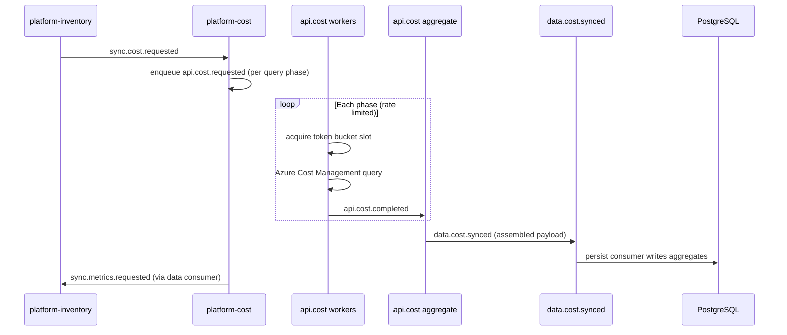

# Services — platform microservices

Production API runs as separate FastAPI services behind a single gateway. Shared logic lives in [app/](../app/README.md).

## Platform services

| Service | Port | Routes (via gateway) |
|---------|------|----------------------|
| [platform-gateway](platform-gateway/README.md) | 8080 | All `/api/*` |
| [platform-auth](platform-auth/README.md) | 8010 | `/auth`, `/settings`, `/admin`, `/k8s` |
| [platform-inventory](platform-inventory/README.md) | 8012 | `/resources`, `/sync`, `/dashboard`, `/azure` |
| [platform-cost](platform-cost/README.md) | 8011 | `/costs`, `/cost`, `/budgets`, `/anomalies` |
| [platform-analysis](platform-analysis/README.md) | 8013 | `/optimize`, `/engine`, `/pipeline`, `/events` |
| [platform-metrics](platform-metrics/README.md) | 8014 | `/metrics` |
| [platform-orchestrator](platform-orchestrator/README.md) | — | Background sync and job coordination |
| [resources/](resources/README.md) | varies | Per-resource-type workers |

## Sync pipeline (Kafka API via Redpanda)

When `KAFKA_ENABLED=true` and `MICROSERVICES_ONLY=1`, the full sync pipeline runs as async jobs over **Redpanda** (Kafka-compatible, single-node dev):

```
POST /resources/sync → 202 + pipeline_id
  → sync.inventory.requested  → platform-inventory
  → sync.cost.requested       → platform-cost
  → sync.metrics.requested    → platform-metrics
  → sync.analysis.requested   → platform-analysis
  → sync.pipeline.completed
```

Poll progress with `GET /sync/pipeline` (unchanged). Set `KAFKA_ENABLED=false` to fall back to in-process daemon threads.

When `KAFKA_DATA_PIPELINE_ENABLED=true` (default with Kafka), each stage **fetches from Azure → publishes to a `data.*` topic → a dedicated persistence consumer writes PostgreSQL** before the next orchestration stage runs.

Topics are provisioned explicitly on stack startup (`redpanda-init`). Manifest: [data/kafka-topics.yaml](../data/kafka-topics.yaml).

### Orchestration topics

| Topic | Partitions | Retention | Producer | Consumer | Consumer group |
|-------|------------|-----------|----------|----------|----------------|
| `sync.inventory.requested` | 6 | 7 days | platform-inventory | platform-inventory | `costoptimizer.platform-inventory` |
| `sync.cost.requested` | 6 | 7 days | platform-inventory | platform-cost | `costoptimizer.platform-cost` |
| `sync.metrics.requested` | 6 | 7 days | platform-cost | platform-metrics | `costoptimizer.platform-metrics` |
| `sync.analysis.requested` | 6 | 7 days | platform-metrics | platform-analysis | `costoptimizer.platform-analysis` |
| `sync.pipeline.status` | 3 | 3 days | all stages | optional | — |
| `sync.pipeline.completed` | 3 | 3 days | all stages | optional | — |

### Data topics (Azure fetch → Redpanda → PostgreSQL)

| Topic | Partitions | Producer | Persistence consumer | Consumer group |
|-------|------------|----------|----------------------|----------------|
| `data.inventory.synced` | 6 | platform-inventory | platform-inventory | `costoptimizer.platform-inventory.persist` |
| `data.cost.synced` | 6 | platform-cost | platform-cost | `costoptimizer.platform-cost.persist` |
| `data.metrics.synced` | 6 | platform-metrics | platform-metrics | `costoptimizer.platform-metrics.persist` |
| `data.analysis.completed` | 6 | platform-analysis | platform-analysis | `costoptimizer.platform-analysis.persist` |

Each platform service runs **two** consumer threads: orchestration (`sync.*.requested`) and data persistence (`data.*`).

`platform-gateway` proxies sync HTTP to `platform-inventory` and does **not** produce or consume Kafka messages.

### API throttle queue (`api.*`)

Rate-limited Azure API work is buffered in Kafka for backpressure, per-subscription ordering, and dead-letter routing. **Partition key:** `subscription_id` on every `api.*` message.

```
Stage worker enqueues work → api.<domain>.requested
  → rate-limited API worker (same platform service)
  → api.<domain>.completed
  → stage continues or persists result

After max retries → api.dead-letter
```

| Topic | Partitions | Retention | Compression | max.message.bytes | Producer | Consumer |
|-------|------------|-----------|-------------|-------------------|----------|----------|
| `api.cost.requested` | 6 | 3 days | lz4 | default (1 MiB) | platform-cost | platform-cost |
| `api.cost.completed` | 6 | 3 days | lz4 | 20 MiB | platform-cost | platform-cost |
| `api.metrics.requested` | 6 | 3 days | lz4 | default | platform-metrics | platform-metrics |
| `api.metrics.completed` | 6 | 3 days | lz4 | 20 MiB | platform-metrics | platform-metrics |
| `api.inventory.requested` | 6 | 3 days | lz4 | default | platform-inventory | platform-inventory |
| `api.inventory.completed` | 6 | 3 days | lz4 | 20 MiB | platform-inventory | platform-inventory |
| `api.dead-letter` | 3 | 14 days | lz4 | 20 MiB | all API services | ops / monitoring |

Consumer groups follow the same pattern: `costoptimizer.platform-cost` (and `.api` suffix when a dedicated API worker group is added).

### Broker infrastructure (Redpanda)

| Context | Compose file | Redpanda mode |
|---------|--------------|---------------|
| Local dev (default) | `docker/desktop/docker-compose.yml` or `docker-compose.microservices.yml` | `dev-container`, 1 core, 20 MiB batch |
| Production overlay | `docker/redpanda.compose.prod.yml` | 2 cores, 2 GiB memory, tuned retention |

**Start with production broker settings:**

```bash
# Microservices stack
docker compose -f docker-compose.microservices.yml -f docker/redpanda.compose.prod.yml up -d redpanda redpanda-init

# Desktop stack
docker compose -f docker/desktop/docker-compose.yml -f docker/redpanda.compose.prod.yml up -d redpanda redpanda-init
```

Production overlay includes resource limits, `kafka_batch_max_bytes=20971520`, `log_retention_ms` (7 days default), and health checks via `rpk cluster health`. TLS/SASL placeholders are documented in the overlay file — configure credentials via environment variables or a secrets manager, not in compose.

| Variable | Default (Docker) | Purpose |
|----------|------------------|---------|
| `KAFKA_MESSAGE_MAX_BYTES` | `20971520` (20 MiB) | `data.*`, `api.*.completed`, `api.dead-letter` topic limit |
| `KAFKA_TOPIC_PARTITIONS` | `6` | Default partition count (override per topic in manifest) |
| `KAFKA_TOPIC_REPLICATION_FACTOR` | `1` | Set `3` for multi-broker production clusters |
| `REDPANDA_VERSION` | `v25.3.1` | Broker image tag |

### Resume on restart

Pipeline progress is persisted in PostgreSQL (`full_sync_pipeline_runs`). If a platform service restarts mid-sync, the pipeline resumes from the last completed stage instead of restarting from inventory.

On **platform-inventory** startup, `resume_incomplete_pipelines()`:

1. Expires stale queued/running rows (timeout rules unchanged).
2. Loads remaining `queued` / `running` pipelines from the DB.
3. Re-publishes the correct `sync.*.requested` job for each subscription (one coordinator — only inventory drives resume).
4. Stage handlers are idempotent: completed stages are skipped; `running` stages are re-run safely.

| Interrupt point | Resume behavior |
|-----------------|-----------------|
| During Azure fetch (before `data.*` publish) | Re-publish same `sync.*.requested` stage |
| After `data.*` publish, before DB persist | Orchestration consumer may re-fetch; persist consumer dedupes via in-process ack + idempotent upserts |
| After stage complete, before next topic publish | Re-publish **next** stage from DB stage status |
| All stages done, pipeline row still `running` | Finalize pipeline as `completed` |

Poll `GET /sync/pipeline` also triggers resume when no in-process worker exists (same logic).

### Message schemas (Schema Registry)

All sync topics share the `JobEnvelope` structure ([app/messaging/job_envelope.py](../app/messaging/job_envelope.py)). JSON Schemas live under [data/kafka/schemas/](../data/kafka/schemas/) and are registered with Redpanda Schema Registry on startup.

**Subject naming:** `{topic}-value` (Confluent-compatible).

| Topic | Schema subject | `job_type` | Payload schema |
|-------|----------------|------------|----------------|
| `sync.inventory.requested` | `sync.inventory.requested-value` | `sync.inventory` | `stage-request.v1` |
| `sync.cost.requested` | `sync.cost.requested-value` | `sync.cost` | `stage-request.v1` |
| `sync.metrics.requested` | `sync.metrics.requested-value` | `sync.metrics` | `stage-request.v1` |
| `sync.analysis.requested` | `sync.analysis.requested-value` | `sync.analysis` | `stage-request.v1` |
| `sync.pipeline.status` | `sync.pipeline.status-value` | `pipeline.status` | `pipeline-status.v1` |
| `sync.pipeline.completed` | `sync.pipeline.completed-value` | `pipeline.completed` | `pipeline-completed.v1` |
| `data.inventory.synced` | `data.inventory.synced-value` | `data.inventory.synced` | `data-synced.v1` |
| `data.cost.synced` | `data.cost.synced-value` | `data.cost.synced` | `data-synced.v1` |
| `data.metrics.synced` | `data.metrics.synced-value` | `data.metrics.synced` | `data-synced.v1` |
| `data.analysis.completed` | `data.analysis.completed-value` | `data.analysis.completed` | `data-synced.v1` |

**API throttle queue** (`api.*`) — partition key `subscription_id`:

| Topic | Schema subject | `job_type` | Payload schema |
|-------|----------------|------------|----------------|
| `api.cost.requested` | `api.cost.requested-value` | `api.cost` | `api-request.v1` |
| `api.cost.completed` | `api.cost.completed-value` | `api.cost.completed` | `api-request.v1` |
| `api.metrics.requested` | `api.metrics.requested-value` | `api.metrics` | `api-request.v1` |
| `api.metrics.completed` | `api.metrics.completed-value` | `api.metrics.completed` | `api-request.v1` |
| `api.inventory.requested` | `api.inventory.requested-value` | `api.inventory` | `api-request.v1` |
| `api.inventory.completed` | `api.inventory.completed-value` | `api.inventory.completed` | `api-request.v1` |
| `api.dead-letter` | `api.dead-letter-value` | `api.dead-letter` | `api-request.v1` |

**Wire format:** UTF-8 JSON (plain). Producers validate against the registered schema before publish; consumers validate on read but accept legacy messages unless `KAFKA_SCHEMA_VALIDATION_STRICT=true`.

**Registry URLs:**

| Context | URL |
|---------|-----|
| Docker services | `http://redpanda:8081` |
| Host (CLI, IDE) | `http://127.0.0.1:18081` |

```bash
# Provision topics + register schemas
./scripts/kafka-topics.sh init

# Register schemas only
./scripts/kafka-topics.sh schemas

# Verify topics and schemas
./scripts/kafka-topics.sh verify
```

### Environment variables (Kafka)

| Variable | Default (Docker) | Used by |
|----------|------------------|---------|
| `KAFKA_ENABLED` | `true` | platform-inventory, -cost, -metrics, -analysis |
| `KAFKA_BOOTSTRAP_SERVERS` | `redpanda:9092` | All Kafka-enabled services |
| `KAFKA_SCHEMA_REGISTRY_URL` | `http://redpanda:8081` | Producers/consumers (validation) |
| `KAFKA_SCHEMA_REGISTRY_ENABLED` | `true` | Schema registration on init |
| `KAFKA_SCHEMA_VALIDATION_ENABLED` | `true` | `kafka_client.py` serialize/deserialize |
| `KAFKA_SCHEMA_VALIDATION_STRICT` | `false` | Reject invalid messages on consume |
| `KAFKA_CONSUMER_GROUP_PREFIX` | `costoptimizer` | Consumer group: `{prefix}.{service_id}` |
| `KAFKA_DATA_PIPELINE_ENABLED` | `true` | Azure fetch → `data.*` topics → DB persist |
| `KAFKA_ENSURE_TOPICS_ON_STARTUP` | `true` | Provision topics before consumers start |
| `KAFKA_MESSAGE_MAX_BYTES` | `20971520` (20 MiB) | Producer, consumer, and `data.*` topic `max.message.bytes` |
| `KAFKA_CHUNK_TARGET_BYTES` | `768000` (750 KiB) | Split large stage payloads before publish |
| `KAFKA_PUBLISH_MAX_RETRIES` | `3` | Publish retries after the initial attempt |
| `KAFKA_PUBLISH_RETRY_BACKOFF_SEC` | `1.0` | Base exponential backoff between publish retries |
| `KAFKA_PUBLISH_DELIVERY_TIMEOUT_SEC` | `10.0` | Broker ack wait per publish attempt |
| `KAFKA_API_THROTTLE_ENABLED` | `true` | Fan out Azure API calls through `api.*` topics |
| `KAFKA_API_DLQ_ENABLED` | `true` | Route failed API jobs to `api.dead-letter` |
| `KAFKA_API_COST_RATE_PER_SEC` | `2` | Cost Management sustained rate (per process) |
| `KAFKA_API_COST_WORKER_CONCURRENCY` | `3` | Target parallel cost API workers |

**Large data payloads:** Stage data (`data.cost.synced`, `data.inventory.synced`, etc.) can exceed the default 1 MiB broker limit. The pipeline automatically chunks oversized sections (for example `cost_by_resource`) into multiple messages with shared `chunk.batch_id`, then reassembles them in the persistence consumer before writing to PostgreSQL. Redpanda is configured for 20 MiB messages in Docker Compose; orchestration topics stay small.

**Publish retries:** `publish_envelope_safe` retries with exponential backoff on produce/delivery failures (`MSG_SIZE_TOO_LARGE`, broker unavailable, delivery timeout). After retries are exhausted the pipeline stays `running` with a retriable publish error; the consumer offset is not committed so Kafka redelivers the stage job, and `resume_incomplete_pipelines` re-publishes interrupted pipelines on service startup.

**Deferred:** `operations_scheduler` scheduled workers still use in-process timers, not Kafka. On-demand full sync via `POST /resources/sync` uses Kafka when enabled.

### API throttling (`api.*` topics)

When `KAFKA_API_THROTTLE_ENABLED=true` (default in Docker microservices), sync stages fan out Azure API calls through dedicated **api.*** Kafka topics with per-API token-bucket rate limits, separate worker consumer groups, and a dead-letter path for poison messages.



| Topic | Consumer group suffix | Role |
|-------|----------------------|------|
| `api.cost.requested` | `.api.cost` | Execute Cost Management queries with rate limit |
| `api.cost.completed` | `.api.cost.aggregate` | Assemble phase results → `data.cost.synced` |
| `api.metrics.requested` | `.api.metrics` | Metrics API stub (full wiring deferred) |
| `api.inventory.requested` | `.api.inventory` | ARM inventory stub (full wiring deferred) |
| `api.dead-letter` | `.api.dlq` | Log failure, mark pipeline stage `failed` |

Orchestration consumer groups (`costoptimizer.platform-cost`) remain separate from API worker pools so you can scale workers without reordering stage jobs.

#### API throttle environment variables

| Variable | Default (Docker) | Description |
|----------|------------------|-------------|
| `KAFKA_API_THROTTLE_ENABLED` | `true` | Fan out Azure calls through `api.*` topics |
| `KAFKA_API_DLQ_ENABLED` | `true` | Publish failed jobs to `api.dead-letter` |
| `KAFKA_API_COST_RATE_PER_SEC` | `2` | Sustained Cost Management requests/sec per worker process |
| `KAFKA_API_COST_BURST` | `4` | Token-bucket burst for cost API |
| `KAFKA_API_COST_WORKER_CONCURRENCY` | `3` | Target parallel cost API workers (scale replicas) |
| `KAFKA_API_METRICS_RATE_PER_SEC` | `3` | Monitor metrics rate limit (stub path) |
| `KAFKA_API_METRICS_WORKER_CONCURRENCY` | `3` | Metrics API worker parallelism |
| `KAFKA_API_INVENTORY_RATE_PER_SEC` | `4` | ARM inventory rate limit (stub path) |
| `KAFKA_API_INVENTORY_WORKER_CONCURRENCY` | `4` | Inventory API worker parallelism |
| `KAFKA_API_AGGREGATE_TIMEOUT_SEC` | `900` | Wait for DB persist after aggregated publish |

**Monitoring:** structlog events `api_throttle.wait`, `api_throttle.http_429`, `api_throttle.job_completed`, `api_throttle.dlq`, and `api_throttle.consumer_lag` track throttle waits, 429s, and DLQ volume. Counters are exposed in-process via `app.messaging.api_throttle.metrics.get_metrics().snapshot()`.

#### Ops runbook (API throttle)

**Scale workers:** increase `platform-cost` replicas and/or lower `KAFKA_API_COST_RATE_PER_SEC` before adding replicas. Worker consumer group: `costoptimizer.platform-cost.api.cost`. Verify lag in Redpanda Console (`api.cost.requested`).

**Handle DLQ:**
1. Inspect `api.dead-letter` in Console or `./scripts/kafka-topics.sh consume api.dead-letter 20`
2. Check `api_throttle.dlq` log lines for `pipeline_id` and `phase`
3. Fix root cause (auth, quota, bad subscription), then `POST /sync/reset` or `force=true` sync
4. Pipeline row is marked `failed` automatically by the DLQ consumer

**Disable throttling:** set `KAFKA_API_THROTTLE_ENABLED=false` — cost stage reverts to monolithic `sync_cost_explorer` fetch inside the orchestration consumer.

Implementation: [app/messaging/api_throttle/](../app/messaging/api_throttle/).

### Data pipeline (Azure → Redpanda → PostgreSQL)

When `KAFKA_DATA_PIPELINE_ENABLED=true` (default with Kafka microservices):

1. **Orchestration consumer** receives `sync.*.requested` → fetches from Azure → publishes `data.*` topic
2. **Persistence consumer** (`{service}.persist` group) receives `data.*` → writes to PostgreSQL → publishes next `sync.*.requested`

| Data topic | Producer | Persistence consumer | DB tables |
|------------|----------|----------------------|-----------|
| `data.inventory.synced` | platform-inventory | platform-inventory | `resource_snapshots` |
| `data.cost.synced` | platform-cost | platform-cost | cost aggregates, billed resources |
| `data.metrics.synced` | platform-metrics | platform-metrics | metrics tables |
| `data.analysis.completed` | platform-analysis | platform-analysis | findings, analysis jobs |

### Message broker web UI

| Path | UI | URL | Image / chart |
|------|----|-----|---------------|
| **Docker Compose** (default dev) | Redpanda Console | [http://127.0.0.1:8085](http://127.0.0.1:8085) | `docker.redpanda.com/redpandadata/console` → `redpanda:9092` |
| **Kubernetes / Helm** | Kafbat UI | [http://127.0.0.1:30085](http://127.0.0.1:30085) | `ghcr.io/kafbat/kafka-ui` via [kafbat Helm chart](../docker/desktop/k8s/kafka-ui-helm/README.md) |

Broker: `docker.redpanda.com/redpandadata/redpanda:v25.3.1` (`dev-container` mode). Services connect via `KAFKA_BOOTSTRAP_SERVERS=redpanda:9092`; host tools use `127.0.0.1:9092`.

**Do not use** `docker.io/provectuslabs/kafka-ui` — blocked for Zafin on Docker Hub. The [Provectus kafka-ui-charts](https://provectus.github.io/kafka-ui-charts) repo defaults to that image; use the **Kafbat** fork instead (`ghcr.io/kafbat/kafka-ui`, chart repo `https://ui.charts.kafbat.io`).

Helm install (from repo root):

```bash
helm repo add kafbat https://ui.charts.kafbat.io
helm upgrade --install costoptimize-kafka-ui kafbat/kafka-ui \
  -n costoptimize --create-namespace \
  -f docker/desktop/k8s/kafka-ui-helm/values.yaml
```

### Broker console (CLI alternative)

Use **rpk** inside the Redpanda container (`costopt-redpanda`) when you prefer the terminal:

```bash
# List topics
./scripts/kafka-topics.sh list

# Describe a topic
./scripts/kafka-topics.sh describe sync.inventory.requested

# Read recent messages
./scripts/kafka-topics.sh consume sync.inventory.requested 10

# List consumer groups
./scripts/kafka-topics.sh groups
./scripts/kafka-topics.sh group-describe costoptimizer.platform-inventory
```

Direct `docker exec` (equivalent):

```bash
docker exec costopt-redpanda rpk topic list -X brokers=redpanda:9092
docker exec costopt-redpanda rpk topic consume sync.inventory.requested -n 10 -X brokers=redpanda:9092
```

Implementation: [app/messaging/](../app/messaging/). Uses `confluent-kafka` against Redpanda's Kafka API (fully compatible).

## Run (Docker — recommended)

```bash
./docker/build.sh up
```

Redpanda broker is on `127.0.0.1:9092`. Redpanda Console is on `127.0.0.1:8085`. For Kubernetes, see [kafka-ui-helm](../docker/desktop/k8s/kafka-ui-helm/README.md).

**Migration from Apache Kafka:** if you previously ran the stack with `apache/kafka`, remove the old volume before starting:

```bash
docker compose -f docker/desktop/docker-compose.yml down
docker volume rm costopt_kafka_data 2>/dev/null || true
./docker/build.sh up
```

## Run (manual, no Docker)

```bash
# Start Redpanda locally on 127.0.0.1:9092, then:
export KAFKA_ENABLED=true MICROSERVICES_ONLY=1 KAFKA_BOOTSTRAP_SERVERS=127.0.0.1:9092

uvicorn services.platform-auth.src.main:app --host 127.0.0.1 --port 8010 &
uvicorn services.platform-inventory.src.main:app --host 127.0.0.1 --port 8012 &
uvicorn services.platform-cost.src.main:app --host 127.0.0.1 --port 8011 &
uvicorn services.platform-analysis.src.main:app --host 127.0.0.1 --port 8013 &
uvicorn services.platform-metrics.src.main:app --host 127.0.0.1 --port 8014 &
uvicorn services.platform-gateway.src.main:app --host 127.0.0.1 --port 8080
```

Frontend dev server proxies `/api` → gateway `:8080`.

## Integration tests

For all routes on one process, use `app.integration_app` — see [tests/](../tests/README.md).

## Parent

[Repository root](../README.md)
